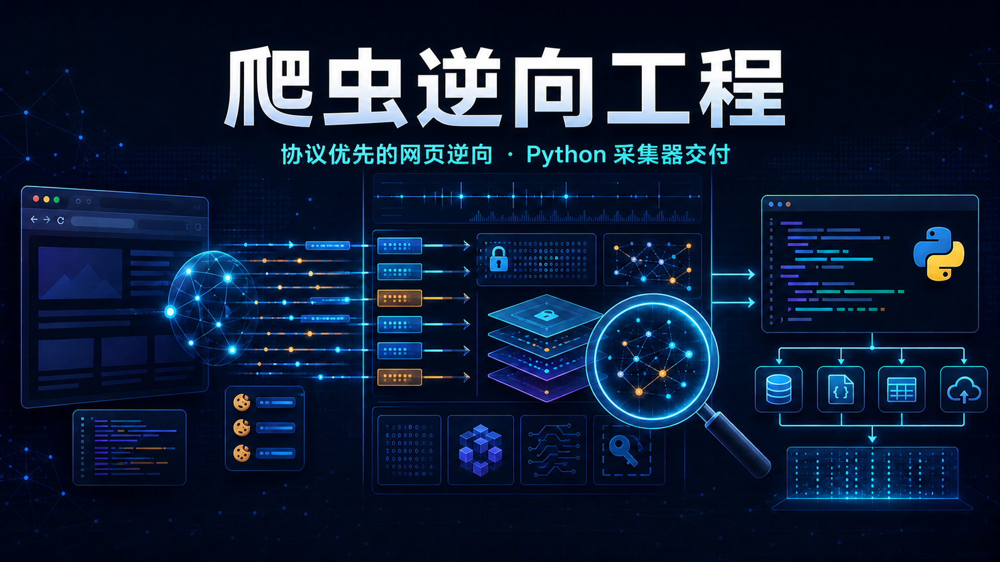

# Crawler Reverse Engineering



`Crawler Reverse Engineering` 是一套面向 Web 协议恢复、参数还原、挑战链路拆解与纯协议交付的逆向工程 Skill。

它的目标不是“让浏览器替你把请求点过去”，也不是“把页面里的 `fetch` 搬出来凑合跑”，而是把那些看起来依赖浏览器环境、页面上下文、挑战脚本或状态流的目标，拆回成一条可复现、可验证、可维护的本地协议链路。

> **Legal / 授权边界**：本仓库仅用于自有系统、已获书面授权的安全测试、互操作研究与教学。未授权抓取、绕过鉴权/风控、窃取凭据或攻击第三方系统，均不在范围内。详见 [DISCLAIMER.md](./DISCLAIMER.md)。你是操作者，自行承担守法责任。

这套 Skill 默认强调以下交付原则：

- 先证据，后结论
- 必须纯协议交付
- 先恢复真实动态状态，再谈分页、并发和规模化
- 浏览器只能用于侦察，不能成为最终依赖
- 最终 collector 优先使用 Python，仅在必要时保留极小 JS、WASM 或本地 bootstrap helper

## 当前版本

**Crawler Reverse Engineering 7.0**

> 从“可调度作战系统”，升级为“先 Auto Judge、再按角色取证、只走已挂载 MCP 的协议恢复技能”。

先记住三点：

1. **先判后开工具**：`artifact-only` / `live-target` / `continuation` 由信号决定，禁止先开浏览器再编理由
2. **线上目标有硬顺序**：先 `fingerprint-baseline`，再 `debugger-trace`；默认 `chrome-devtools` → `js-reverse`
3. **Camoufox 不是默认**：只有指纹压力被证明，或干净基线失败时，才升级 managed profile

## 核心定位

`Crawler Reverse Engineering` 解决的不是“如何自动点击页面”，而是下面这类协议恢复问题：

- 页面代码写的是一个接口，但真实网络请求走的是另一个接口
- 业务层构造了 `sign`、`token` 或 `m`，但发包前又被 transport wrapper 重写
- 请求能发出去，但响应还要经过解码、解密、字形映射、JSONP 拆包或二进制解析
- 页面能打开，但协议重放不稳定，表现为 `403`、`412`、`429`、偶发成功、只成功第一页或只在某条路由成功
- Cookie、挑战脚本、WASM、WebSocket 会话、协议包裹和响应侧解码缠在一起，无法只靠“找 sign”解决
- 看起来是浏览器专属逻辑，但实际可在本地运行时、局部 helper 或纯 Python 中恢复关键状态

一句话概括：

> 它是一套把 hostile web client 还原成 stable protocol collector 的方法论与执行框架。

## 7.0 更新了什么

相对 6.0，7.0 的核心变化不是再堆一批 profile，而是把 **MCP 选择、基线主机和调试取证** 写成不可跳过的门禁。

### 1. Auto Judge 成为开局硬规则

动手前必须先回答：

- 当前是 `live-target`、`artifact-only` 还是 `continuation`
- 要不要开浏览器
- 基线主机用 stock Chromium 还是 Camoufox / managed profile
- 调试取证能不能上 `js-reverse`

样本已经够、不需要新鲜 live 接受时，走 `artifact-only`，禁止为了仪式感打开 Chrome / Camoufox / `js-reverse`。

### 2. live-target 的硬顺序 W1

```text
capability snapshot
  -> Auto Judge
  -> fingerprint-baseline（默认 chrome-devtools）
  -> debugger-trace（默认 js-reverse，需要 debug attach）
  -> 离线重建 / Python collector
```

- 同一时刻最多一个 `TARGET_ACTIVE` 浏览器族
- 两套浏览器不得同批并行打同一目标
- 基线成功但没有 attach 面：导出产物，记录 `debugger_attach_gap`，转离线
- APK / 原生 App / 小程序主任务直接 out-of-scope，不编造双浏览器仪式

完整路由表见 `references/mcp-routing-playbook.md`。

### 3. 新增 MCP 与本机环境文档

| 文件 | 用途 |
|---|---|
| `references/mcp-routing-playbook.md` | 把已挂载 MCP 映射到 intake / 证据角色 / 基线主机；未挂载的不当成可用 |
| `references/local-mcp-environment.md` | 本机 attach / 端口 / host 占位说明；私人路径和密钥不得进仓库 |

Camoufox 只是 **baseline host / ENV surface**，不是 `js-reverse` 替代品，更不是 collector 运行时。

### 4. 测试卫生与发布包更干净

- 恢复 `.gitignore`
- 新增 `pytest.ini`：`-p no:cacheprovider`
- 新增 `tests/conftest.py`：禁止字节码，清理 `__pycache__` / pytest 缓存 / runner dump
- 共享包只放机器无关默认值；`*.local.md` 必须留在 skill 树外

### 5. 6.0 能力全部保留

7.0 没有拆掉 6.0 的执行资产，继续包含：

- 三大可执行 profile：`browser-hook-snippets` / `static-ast` / `env-patch`
- 证据工具链与 `validate_skill.py`
- 官方自测套件与 forward-testing

## 6.0 留下的底座

6.0 把 Skill 从说明书推进成可调度、可执行、可验证的工程资产。7.0 默认继承这些能力：

- `Lightweight Dispatch`：`evidence` / `local-proof` / `compact-replay` / `collector`
- Fast Routes：已知边界直接走 Hook / AST / env-patch / pure-Python rebuild
- 任务产物契约：过程证据落在项目 `js_reverse_cache/tasks/<task-id>/`
- browser-free collector、固定样本验证、证据脱敏

## 当前包体量

基于本仓库实际内容：

- 有效文件约 **170**
- 根 playbook 约 **59**
- 可执行 profile：**3** 套
- 脚本约 **13**
- 测试覆盖环境检查、证据归一化、脚手架、协议工具、validate_skill 等

## 核心能力

当前版本围绕 `chrome-devtools` 与 `js-reverse` 展开，强调 Auto Judge、轻量串行侦察、离线还原和 Python-first 交付。

主要能力包括：

- 协议路径恢复
- 动态状态定位
- 协议包裹恢复（GraphQL / WebSocket / protobuf / msgpack / wrapper）
- 响应侧恢复
- 环境差异与补丁分析
- 挑战与 bootstrap 链恢复
- 状态流与会话链恢复
- browser-hook / static-ast / env-patch 专线
- pure Python rebuild 与 transport profile
- Python-first collector 交付

## 方法论概览

最短主线：

1. 完成 Auto Judge + `Startup Gate`
2. 按 intake 选择最小路径；`live-target` 先基线后调试
3. 找到真实请求与真实动态状态
4. 在本地离线重建这些动态状态
5. 交付脱离浏览器运行的 Python collector

### 1. Startup Gate

- 声明 intake 模式：`live-target` / `artifact-only` / `continuation`
- 检查环境与**当前会话真正挂载**的 MCP
- 做目标家族分流
- 声明最终交付意图

优先分类：

- `signer-gated`
- `verifier-gated`
- `decode-gated`
- `session-gated`
- 必要时补充 `transport-gated`

### 2. 轻量双角色侦察

fresh `live-target`：

- `fingerprint-baseline` / `chrome-devtools`：页面状态、跳转链、首轮网络视图
- `debugger-trace` / `js-reverse`：initiator、源码搜索、wrapper 与 mutation 假设

强调：

- 轻量优先
- 串行保护易失状态
- 已有 HAR / 抓包 / 固定向量时优先 `artifact-only`
- 默认不用 Camoufox

### 3. 识别真实动态状态

> 真正变化的东西，不一定叫 `sign`。

可能是：

- 旋转 Cookie
- 页面专属 header
- wrapper 字段
- 服务端引导 JS
- 动态字体
- WASM 导出
- 响应侧解码链
- 会话绑定状态
- 业务上下文激活结果
- challenge artifact
- transport envelope / 二进制帧状态

### 4. 离线重建优先级

1. 纯 Python
2. Python + 极小 JS helper
3. Python + 极小 WASM helper
4. Python + 本地 embedded runtime / bootstrap executor
5. 继续逆向，而不是退回浏览器自动化

### 5. 重复性验证

至少验证：

- 同样逻辑稳定成功 2 到 3 次
- 分页 / cursor 正确推进
- 关键动态状态可再生
- 固定输入输出可验证
- 最终路径不依赖浏览器自动化

## 目录结构

```text
crawler-reverse-engineering/
├── README.md
├── DISCLAIMER.md
├── LICENSE
├── SKILL.md
├── pytest.ini
├── agents/
│   └── openai.yaml
├── scripts/
│   ├── check_reverse_env.py
│   ├── crypto_fingerprint.py
│   ├── protocol_diff.py
│   ├── scaffold_reverse_project.py
│   ├── evidence_normalizer.py
│   ├── transcript_diff.py
│   ├── transform_trace_diff.py
│   ├── transport_profile_diff.py
│   ├── forward_test_report.py
│   ├── grpc_frame_inspector.py
│   ├── practice_lab.py
│   └── validate_skill.py
├── tests/
└── references/
    ├── mcp-routing-playbook.md
    ├── local-mcp-environment.md
    ├── doctrine-index.md
    ├── startup-triage-playbook.md
    ├── official-self-test-task-suite.md
    ├── examples/
    │   └── douyin-bdms-pure/
    └── profiles/
        ├── browser-hook-snippets/
        ├── static-ast/
        └── env-patch/
```

## 关键参考文档

第一次建议按这个顺序读：

1. `SKILL.md`
2. `references/mcp-routing-playbook.md`
3. `references/startup-triage-playbook.md`
4. `references/workflow-overview.md`
5. `references/doctrine-index.md`
6. `references/official-self-test-task-suite.md`

按场景跳转：

- MCP / 基线主机选择：`mcp-routing-playbook.md`
- 本机 attach 占位：`local-mcp-environment.md`
- 已知边界贴 Hook：`profiles/browser-hook-snippets/index.md`
- 结构化还原 JS：`profiles/static-ast/index.md`
- 本地补环境：`profiles/env-patch/index.md`
- 固定轨迹纯 Python 重写：`pure-python-rebuild-playbook.md`
- 不透明多阶段签名：`opaque-runtime-profile-playbook.md`
- 传输准入：`transport-pre-gate-playbook.md`
- 前向验证：`forward-testing-playbook.md`
- 伪完成排查：`anti-patterns-playbook.md`
- 技能维护：`skill-maintenance.md`

## 安装方式

```bash
git clone https://github.com/xnuyoah/crawler-reverse-engineering.git ~/.codex/skills/crawler-reverse-engineering
```

Windows 也可放到：

```text
%USERPROFILE%\.codex\skills\crawler-reverse-engineering
```

安装后建议：

```bash
python scripts/check_reverse_env.py
python scripts/validate_skill.py
```

## 适用场景

- 需要恢复参数、协议包裹、响应解码或状态流
- 目标存在 challenge、bootstrap、动态 Cookie、WebSocket、GraphQL、protobuf、WASM 或环境绑定逻辑
- 最终目标是可复现、可长期维护的协议采集器
- 已有 HAR / 抓包 / 固定向量，只想做 artifact-only 本地证明
- 已知边界，需要 Hook / static-ast / env-patch / pure rebuild

## 不适用场景

- 需求本质只是标准 UI 自动化
- 只要求一次性浏览器脚本，不关心协议可复现性
- 最终交付允许长期依赖浏览器 profile 或人工点击
- 主目标是 APK / 原生 App / 小程序
- 不具备合法授权边界

## 交付标准

理想产物：

- 真实接口路径说明
- 动态状态分类结论
- 关键证据与固定样本
- Python collector
- 必要时的极小 JS / WASM / runtime helper
- Cookie / session / challenge artifact 来源说明
- 风险与不稳定点说明
- right-click 可运行入口（`main.py` 或等价路径）

合格底线：

- 不依赖浏览器自动化
- 不依赖手工页面操作
- 重放逻辑可重复成功
- 动态状态可解释、可验证、可再生
- browser-free / runtime-free 边界说清
- 敏感值未进入公开日志或版本控制

## 从 6.0 升级到 7.0

- 主方法论兼容，profile 和证据工具链继续用
- 开局先读 `SKILL.md` 的 Auto Judge 与 `mcp-routing-playbook.md`
- 低风险 live-target 默认 `chrome-devtools`，不要一上来开 Camoufox
- 只路由当前会话已挂载的 MCP，磁盘上有源码不等于可用
- 私人端口、profile 路径、API key 写到 skill 树外的 `*.local.md`
- 发布或大改后至少跑 `validate_skill.py`

## 一句话总结

`Crawler Reverse Engineering` 不是让浏览器替你干活。

它是让你把浏览器里看起来神秘、脆弱、依赖上下文的行为，拆回成一条可验证、可复现、可长期运行的本地协议链路。

**7.0 的强点，在于把工具选择从“先打开再解释”，推进到了“先判定、再按角色取证、只走已挂载能力”。**
